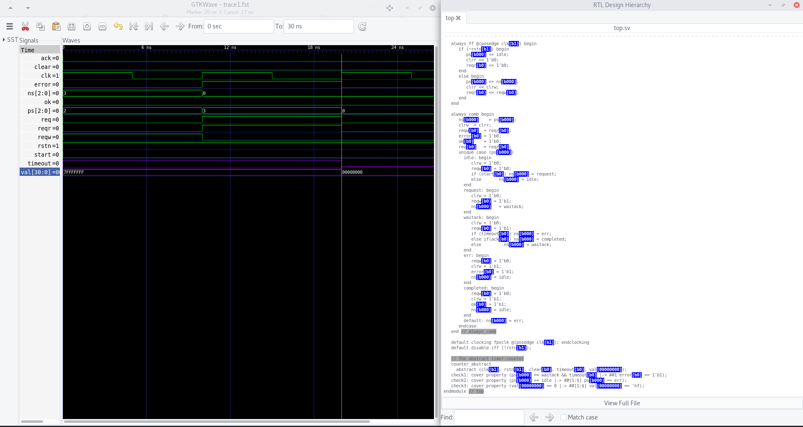

# Abstractions and RTL Browser



## How to
There is a bash script called `run`. Execute it to get the same waveform.
It basically executes 4 steps:
* Run the `SBY` file.
* Convert the VCD to FST format.
* Parse (instrument) the RTL for live annotation (RTL Browser)
* Open the FST file

```bash
echo "[I] Running SBY"
sby -f top.sby

echo "[I] Converting VCD to FST file"
vcd2fst -v top/engine_0/trace0.vcd -f trace0.fst
vcd2fst -v top/engine_0/trace1.vcd -f trace1.fst
vcd2fst -v top/engine_0/trace2.vcd -f trace2.fts

echo "[I] RTL Browser preparation"
# run it once, and without checker/assertions or verilator will fail to generate the xml
#verilator -Wno-fatal top.sv abstract.sv -xml-only --bbox-sys --top-module top
#xml2stems obj_dir/Vtop.xml top.stems

echo "[I] Running GTKWave"
#gtkwave -t top.stems trace0.fst
gtkwave -t top.stems trace1.fst
```

Looking to improve the process!
